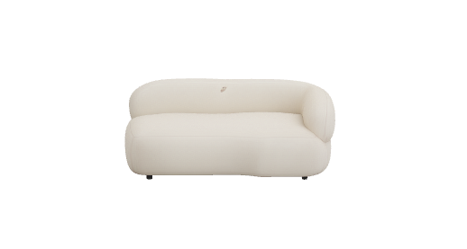
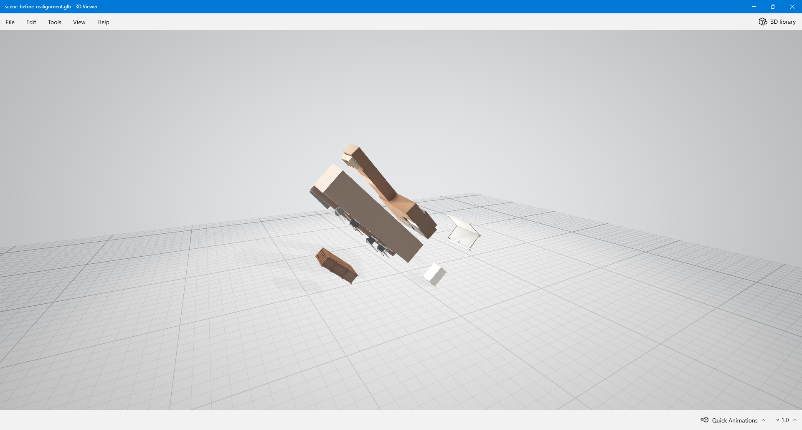
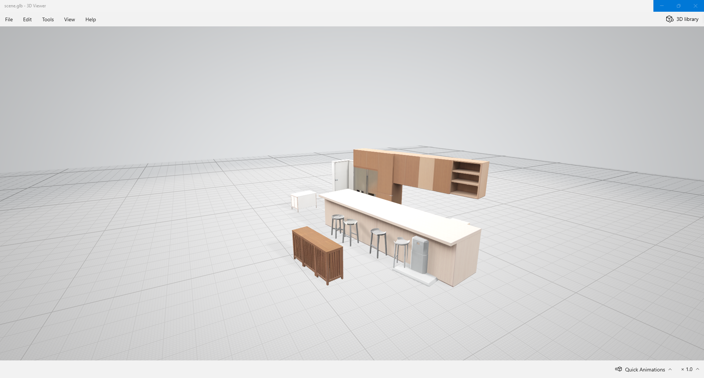
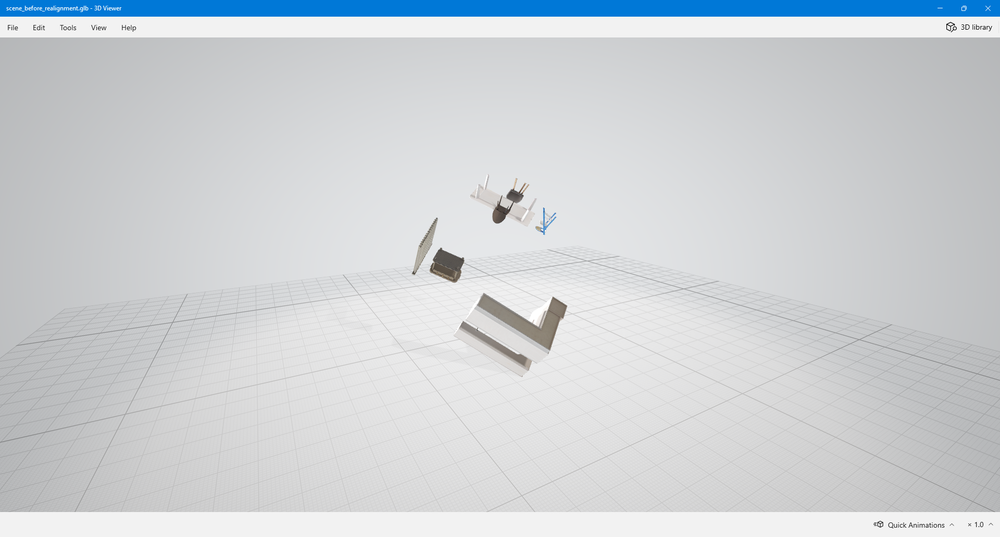
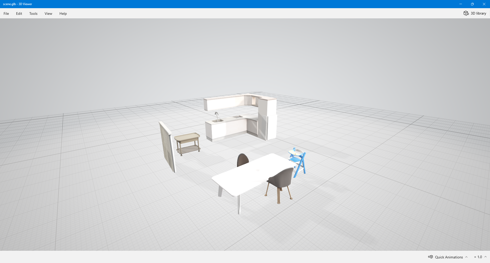

> [!NOTE] 
> This README was created with AI help to give you clear setup and usage instructions for sam-3d-objects. 
>
> This repository is based on the original code at https://github.com/facebookresearch/sam-3d-objects and the paper https://ai.meta.com/research/publications/sam-3d-3dfy-anything-in-images/.
>
> The original README file has been renamed to [_README.md](_README.md).

<br>

## Installation

### Vessl Environment Setup
To set up the SAM3D environment in Vessl, set the Custom Image to `docker.io/cjfl2343/sam-3d:0.0.2`. This image was made for this project. The Docker image comes from the [`Dockerfile.sam-3d`](Dockerfile.sam-3d) file in this repository.
**Since this image uses CUDA 12.1 and SAM 3D requires at least 32GB of VRAM for multi-object inference, it is recommended to use a node `eve-s01`, `space-01` or similar node.**


<div align="center" >
    
    <br><br>
    <i>Set Custom Image to </i> <code>docker.io/cjfl2343/sam-3d:0.0.2</code>
</div>

<br>

### Repository Setup

To get started with sam-3d-objects, first clone this repository:
This will create a folder named `KOCCA-SAM3D` with all necessary source code and scripts.

```bash
git clone https://github.com/KAIST-VML/KOCCA-SAM3D.git
cd KOCCA-SAM3D
```

<br>

## Set Up Environment & Pretrained Models 

To set up the environment and pre-trained models, run these scripts in order:

1. Install dependencies:

   ```bash
   bash setup_a.sh
   ```
   <br>

   Even if you see the following messages after dependencies are installed, you can ignore them and proceed to the next step.

   ```text
   ERROR: pip's dependency resolver does not currently take into account all the packages that are installed. This behaviour is the source of the following dependency conflicts.
   lightning 2.3.3 requires packaging<25.0,>=20.0, but you have packaging 25.0 which is incompatible.
    ipykernel 7.1.0 requires jupyter-client>=8.0.0, but you have jupyter-client 7.4.9 which is incompatible.
    vessl 0.1.199 requires google-cloud-storage<3.0.0,>=2.15.0, but you have google-cloud-storage 2.10.0 which is incompatible.
    
    WARNING: Running pip as the 'root' user can result in broken permissions and conflicting behaviour with the system package manager, possibly rendering your system unusable. It is recommended to use a virtual environment instead: https://pip.pypa.io/warnings/venv. Use the --root-user-action option if you know what you are doing and want to suppress this warning.
    ```

   <br>

2. Request model checkpoints by providing some information at https://huggingface.co/facebook/sam-3d-objects:

    <div align="center" >
        
        <br><br>
        <i>Request Form</i>
    </div>
    
    <br>


3. Install pre-trained models **(Once your request to access the model checkpoints has been accepted and your Huggingface token has been created)**:

    ```bash
    export HUGGINGFACE_TOKEN=<your_huggingface_token>
    bash setup_b.sh
    ```

<br>

## Inference

The `main_inference.py` script can generate either a single object or an entire scene from an input image using pre-trained model weights.

<br> 

### Single Object Inference

To generate a 3D object from a single mask, specify the image path and the index of the mask to use (`--mask_index=N`). For example, to extract the object using mask index 26:


<div align="center" display="flex">
    
    
    <br>
    <i>From the left, input image · generated mesh</i>
</div>

<br>

```bash
python main_inference.py \
    --image_path=notebook/images/shutterstock_modern_colorful_Interior_2620125197/image.png \
    --mask_index=26 \
    --output_dir=output \
    --export_images=false \
    --re_alignment_mode="none"
```

<br>

### Multi Object Inference

To generate 3D meshes for all object masks in an input image and combine them into a scene, set `--mask_index=-1`.

Note that the sample data for inference includes pre-defined masks; setting `-1` uses these masks. If you want to run inference on your own images without providing specific masks, see "Inference with Auto Masking."


<div align="center" display="flex">
    
    
    <br><br>
    <i>From the left, input image · generated meshes</i>
</div>

<br>

```bash
python main_inference.py \
    --image_path=notebook/images/shutterstock_stylish_kidsroom_1640806567/image.png \
    --mask_index=-1 \
    --output_dir=output \
    --export_images=false \
    --save_all_objects=false \
    --re_alignment_mode="none"
```

<br>

### Inference w/ Automatic Mask Generation

If you do not have object masks for your input image, you can use automatic mask generation by setting `--mask_index=-2`. Originally, sam-3d-objects did not support auto-masking functionality; therefore, a pipeline was added that automatically segments interior objects. The pipeline uses [SAM 3](http://huggingface.co/docs/transformers/en/model_doc/sam3) (`facebook/sam3`) to detect interior objects in the image before generating 3D models for each detected object. You can control the segmentation behavior through `--sam_prompt`, `--sam_threshold` and `--sam_mask_threshold` parameters.

<div align="center" display="flex">
    
    
    <br> <br>
    <i>From the left, input image · generated meshes</i>
</div>

<br>

```bash
python main_inference.py \
    --image_path=notebook/images/_9gFNBQJmk9WmdYWtkwfo45/image.png \
    --mask_index=-2 \
    --output_dir=output \
    --export_images=false \
    --save_all_objects=false \
    --re_alignment_mode="none" \
    --sam_prompt="interior objects" \
    --sam_threshold=0.4 \
    --sam_mask_threshold=0.4
```

The `--sam_prompt` parameter specifies what types of objects to detect (default: `"interior objects"`). You can also tune `--sam_threshold` and `--sam_mask_threshold` to control segmentation sensitivity.

<br>

## Profiling

The `main_profile.py` script benchmarks inference speed for one or more images and outputs per-mask timing statistics.

<br>

### Profiling All Images

To benchmark inference performance on all images in `./notebook/images/` (approximately 230 total object masks across all images), run:
 
```bash
python main_profile.py \
    --images_dir=./notebook/images/ \
    --output_dir=./output/_profile/ \
    --use_inference_cache=false \
    --save_profile_summary=false \
    --wait=0 \
    --warmup=1 \
    --active=3
```

<br>

### Method

Inference was executed for approximately 230 individual objects. For each object, the schedule was set to wait = 0, warmup = 1, active = 3, yielding a total of four runs per object. Only the three active-step wall-clock times were recorded and averaged to produce the reported per-object mean. Timing was measured as the difference of `time.perf_counter()` after calling `torch.cuda.synchronize()` at each iteration to enforce GPU synchronization.

<br>

### Results

On an NVIDIA A5000 GPU (24 GB VRAM), the mean wall-clock time per single-object inference is `37.004264873904155` seconds. If we exclude model-loading overhead, the runtime is expected to decrease by approximately 20%. In this benchmark, the configuration was intentionally conservative: the model was reloaded on every run.


| mask_index                                           | elapsed_time_at_active_step_001 | elapsed_time_at_active_step_002 | elapsed_time_at_active_step_003 | elapsed_time_average       |
|------------------------------------------------------|----------------------------------|----------------------------------|----------------------------------|-----------------------------|
| 0_kid_box                                            | 45.33452668134123                | 45.4912094604224                 | 45.65570163633674                | 45.49381259270013           |
| 1_kid_box                                            | 29.45958050340414                | 30.371026386506852               | 30.46039948984981                | 30.097002126586933          |
| 2_kid_box                                            | 36.62481936812401                | 36.83841050881893                | 37.89146111905575                | 37.11823033199956           |
| ...                                                  | ...                              | ...                              | ...                              | ...                         |
| 0_shutterstock_1243680295                            | 31.51510568056256                | 31.225410433486104               | 31.995900759473443               | 31.578805624507368          |
| 1_shutterstock_1243680295                            | 51.53862490598112                | 51.73792759235948                | 51.409426456317306               | 51.56199298488597           |
| 2_shutterstock_1243680295                            | 31.32706823106855                | 31.51491724140942                | 31.40297007188201                | 31.41498518145333           |
| ...                                                  | ...                              | ...                              | ...                              | ...                         |
| **mean**                                                 | 37.063137248682075               | 36.85683911495199                | 37.09281825807841                | **37.004264873904155**          |

<br>

For multi-object inference, the pipeline still performs per-object inference independently and then merges the outputs into a single scene. The merging step increases memory requirements, so a GPU with at least 32 GB VRAM is likely necessary. Because multi-object scene generation time depends on the number of object masks in the image ($M$), a practical estimate is $M \times 30$ seconds if one assumes $30$ seconds for single-object generation.


<br>

## Post Processing

### Scene Re-alignment Modes

After merging per-object results, the script can re-align the scene geometry. The main options (`--re_alignment_mode`) are:

- `none`: No transformation is applied (default).
- `pca`: Applies PCA to align the scene's main axes with the coordinate axes.
- `obb`: Uses an oriented bounding box (OBB) of the entire scene for alignment.
- `obb+`: For each object, computes its OBB and re-orients so that its bottom face is parallel to the XY-plane 

<br>

The `obb+` mode assumes:
1. Each object's OBB bottom face is its true bottom.
2. Object bottoms are nearly parallel to the global XY-plane.
3. There are no "floating" (z-offset) objects.

<div align="center" display="flex">
    
    
    
    <br>
    <i>From the left, <br> 
    input image · scene without re-alignment · scene with re-alignment</i>
</div>

<br>

```bash
python main_inference.py \
    --image_path=notebook/images/_R022/image.png \
    --mask_index=-2 \
    --output_dir=output \
    --re_alignment_mode="obb+" \
    --sam_prompt="furniture" \
    --sam_threshold=0.27
```

<br><br>

<div align="center" display="flex">
    
    
    
    <br>
    <i>From the left, <br> 
    input image · scene without re-alignment · scene with re-alignment</i>
</div>

<br>


```bash
python main_inference.py \
    --image_path=notebook/images/_R022/image-iso.png \
    --mask_index=-2 \
    --output_dir=output \
    --re_alignment_mode="obb+" \
    --sam_prompt="furniture" \
    --sam_threshold=0.27
```

<br>

## Processing `VSA_dataset`

The `main_vsa_dataset.py` script automates the generation of 3D models for both individual objects and complete room scenes from a hierarchical dataset. Processing is skipped if the isometric room view `(*_IsoView1.png or *_Isoview1.png)` does not exist.


```bash
python main_vsa_dataset.py \
    --dataset_dir=./VSA_dataset \
    --output_dir=./VSA_output \
    --sam_prompt="furniture" \
    --sam_threshold=0.27
```


<br>

### Processing Pipeline

For each dataset folder, the script executes a two-stage pipeline:

1. Individual Object Processing

    The script iterates through all object subfolders and generates a single 3D model for each object using its corresponding isometric view image. 

    Output for individual objects:
    ```
    VSA_output/
    └── R022/
        ├── Object0/
        │   ├── image.png
        │   └── object.glb
        ├── Object1/
        │   ├── image.png
        │   └── object.glb
        └── ...
    ```

    <br>

2. Room Scene Processing

    The script processes the isometric room image using automatic mask generation (SAM with `--mask_index=-2`). Multiple objects are segmented and reconstructed independently before being merged into a unified scene representation.

    Output for the room scene:
    ```
    VSA_output/
    ├── R022/
    │   ├── Object0/
    │   ├── Object1/
    │   ├── ...
    │   └── Scene/
    │       ├── 3d/
    │       │   ├── object_000.glb                  # reconstructed object
    │       │   ├── object_001.glb
    │       │   └── ...
    │       ├── mask/
    │       │   ├── mask_000.png                    # automatically segmented mask
    │       │   ├── mask_001.png
    │       │   └── ...
    │       ├── image.png                           # original room image
    │       ├── scene_before_realignment.png        # merged scene before applying realignment
    │       ├── scene_obbs.png                      # oriented bounding boxes corresponding to all objects 
    │       └── scene.glb                           # merged scene
    ├── ...
    ```
